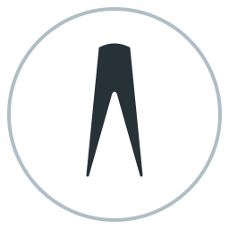

<p align="center">
  
</p>

# Altium Assembly Tool

A 2D PCB assembly viewer for Altium `.PcbDoc` files built with PySide6. Step through the BOM, track which components have been placed, mark No-Fit parts, and save progress between sessions.

## How to use 

### 1. Open a PCB file

Click **Open File** and select a `.PcbDoc` file. A progress dialog tracks the load. Once done, the board renders in the top pane and the BOM table populates below.


<p align="center">
  
</p>


<p align="center">
  
</p>


### 2. (Optional) Load a project file for No-Fit data

Click **Load .PrjPcb** and select the `.PrjPcb` file for the same project. This reads the active variant's **Do Not Place** (DNP) list and applies it automatically:

- DNP component refs appear **red** in the BOM table.
- DNP components show a **red X** overlay in the board view when their BOM row is selected.
- DNP parts count as already placed for the purpose of row completion — so a row with one real part and one DNP part turns green once the real part is double-clicked.

<p align="center">
  
</p>

### 3. Step through the BOM

Click any row in the BOM table to highlight that component group on the board (all other components dim).

Navigate with:
- **◄ Prev / Next ►** buttons in the toolbar
- **Up / Down arrow keys** (when the BOM table does not have focus)
- **Clear Selection** to return to the full board view

### 4. Mark components as placed

With a BOM row selected, **double-click a component pad** in the board view to mark it as placed:


<p align="center">
  
</p>

- A **green border box** appears around the component.
- The ref turns **bold green** in the Top Refs or Bottom Refs column.
- When every ref on one side is placed, that side's cell turns green.
- When every ref in the row (both sides, excluding DNP parts) is placed, the **whole row turns green**.

> Double-click only works for refs in the currently selected BOM row, on the currently viewed side. This prevents accidental mis-clicks on dense boards.

Double-clicking a placed component toggles it back to unplaced.

### 5. Switch board sides

Use **Top Side / Bottom Side** in the toolbar to flip the board and view the other side. The highlighted components and placement markers update automatically.

### 6. Save and reload progress

- **Save State** — writes current placement progress to a `.json` file (defaults to the same folder as the `.PcbDoc`).
- **Open State** — reloads a previously saved session.

The state file is plain JSON containing only the list of placed designators.

---

## Board view controls

| Action | Control |
|---|---|
| Zoom | Scroll wheel |
| Pan | Left-drag |
| Fit to window | **Fit View** button or **Ctrl+0** |

---

## BOM table reference

| Column | Description |
|---|---|
| # | Row number |
| QTY | Total designators in the group |
| Placed | How many are placed or DNP |
| To Place | Remaining to physically place |
| Name | Component value / part number |
| Top Refs | Designators on the top side |
| Bottom Refs | Designators on the bottom side |

- All columns are resizable — drag the header border, or double-click to auto-fit.
- Right-click a row to copy all refs, top refs, or bottom refs to the clipboard.

---

## Toolbar reference

| Section | Controls |
|---|---|
| *(file)* | Open File, Load .PrjPcb, filename |
| **Steps** | ◄ Prev, Next ►, step counter |
| **View** | Fit View, Clear Selection |
| **Config** | Save State, Open State |
| **Board Side** | Top Side, Bottom Side |

---

## Visual reference

| Indicator | Meaning |
|---|---|
| Green border box on component | Manually marked as placed |
| Red X on component | DNP / No Fit (from .PrjPcb) |
| Bold green ref in BOM | That designator is placed |
| Red ref in BOM | That designator is DNP |
| Green cell in BOM | All refs on that side are done |
| Green row in BOM | All refs (both sides) are done |
| Orange/white striped pad | Pin 1 marker |


---

## Browser mode

The tool includes a browser-based UI as an alternative to the desktop window. It runs a local Flask web server and opens your default browser automatically — useful when you want to access the interface remotely or avoid the PySide6 dependency.

<p align="center">
  
</p>


### Starting the browser UI

```
python main.py --browser
```

Or to load a PCB file immediately on launch:

```
python main.py --browser "C:\path\to\board.PcbDoc"
```

By default the server listens on port **4321**. Use `--port` to change it:

```
python main.py --browser --port 8080
```

The server URL is printed to the terminal and the browser opens automatically:

```
Serving at http://127.0.0.1:4321  (Ctrl-C to quit)
```

### Loading a file

Because the browser has no access to your local filesystem, files are loaded by typing their full path into a dialog that appears on startup. An optional `.PrjPcb` path can be entered in the same dialog to load DNP data.

Click **Open PCB** in the toolbar at any time to reload or switch files.

### Differences from the desktop app

| Feature | Desktop | Browser |
|---|---|---|
| File picker | Native OS dialog | Type the full file path |
| DNP data | **Load .PrjPcb** button | Entered in the load dialog alongside the PCB path |
| Save / load state | **Save State** / **Open State** buttons | Auto-saved on every toggle to `<board>.popstate.json` in the same folder |
| Keyboard shortcuts | ↑ / ↓ | ↑ ↓ ← → (all four arrows step through BOM), **0** fits the view |

Everything else — BOM table, component highlighting, double-click to mark placed, DNP overlays, top/bottom side switching — works identically.

---

## Requirements

- **Python 3.12** (recommended — PySide6 support for 3.14+ is limited)
- **Git** (required to install `altium-monkey` from GitHub)

---

## Installation

### Step 1 — Check your Python version

Open a terminal (PowerShell or Command Prompt) and run:

```
python --version
```

You need **3.12.x**. If you see a different version, install Python 3.12 from [python.org](https://www.python.org/downloads/) and come back.

---

### Step 2 — Create a virtual environment

Try these commands in order until one works:

```
py -3.12 -m venv .venv
```

If that gives an error, try:

```
python3.12 -m venv .venv
```

If that also fails, and `python --version` already shows 3.12, just use:

```
python -m venv .venv
```

You should see a `.venv` folder appear in the project directory.

---

### Step 3 — Activate the virtual environment

**Windows (PowerShell):**
```powershell
.\.venv\Scripts\Activate.ps1
```

**Windows (Command Prompt):**
```
.venv\Scripts\activate.bat
```

Your prompt will change to show `(.venv)` when the environment is active.

> **PowerShell execution policy error?** Run this once, then try again:
> ```powershell
> Set-ExecutionPolicy -ExecutionPolicy RemoteSigned -Scope CurrentUser
> ```

---

### Step 4 — Install dependencies

```
pip install -r requirements.txt
```

This installs PySide6 and `altium-monkey` (fetched directly from GitHub).

> **Git must be on your PATH for this to work.** Here's how to check and fix it:
>
> **Check:** Open a new terminal and run:
> ```
> git --version
> ```
> If you see something like `git version 2.x.x` you're good. If you get *"command not found"* or *"is not recognized"*, Git is either not installed or not on your PATH.
>
> **Fix — not installed:** Download and install Git from [git-scm.com](https://git-scm.com/downloads). During installation, leave the default option **"Git from the command line and also from 3rd-party software"** selected — this adds Git to your PATH automatically.
>
> **Fix — installed but not on PATH:** Open **Start → search "Environment Variables" → Edit the system environment variables → Environment Variables**. Under *System variables*, find `Path`, click Edit, and check whether a Git entry (e.g. `C:\Program Files\Git\cmd`) is listed. If not, click New and add that path (adjust to wherever Git is installed on your machine). Click OK on all dialogs, then **open a new terminal** (the old one won't pick up the change) and run `git --version` again to confirm.

---

### Step 5 — Run the app

```
python main.py
```

You should see the Altium Assembly Steps window open.

---

## Subsequent runs

You only need to activate the virtual environment, then run:

```
.\.venv\Scripts\Activate.ps1
python main.py
```

Or pass a `.PcbDoc` file directly to open it on launch:

```
python main.py "C:\path\to\your\board.PcbDoc"
```

---
